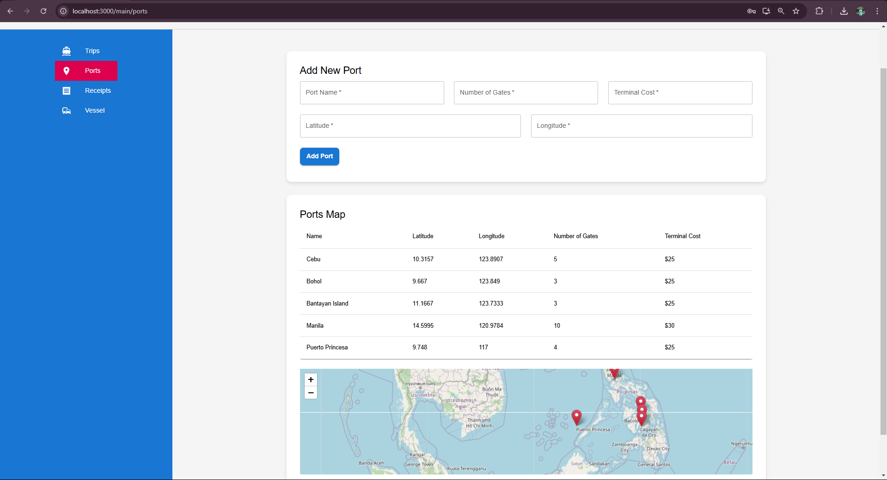
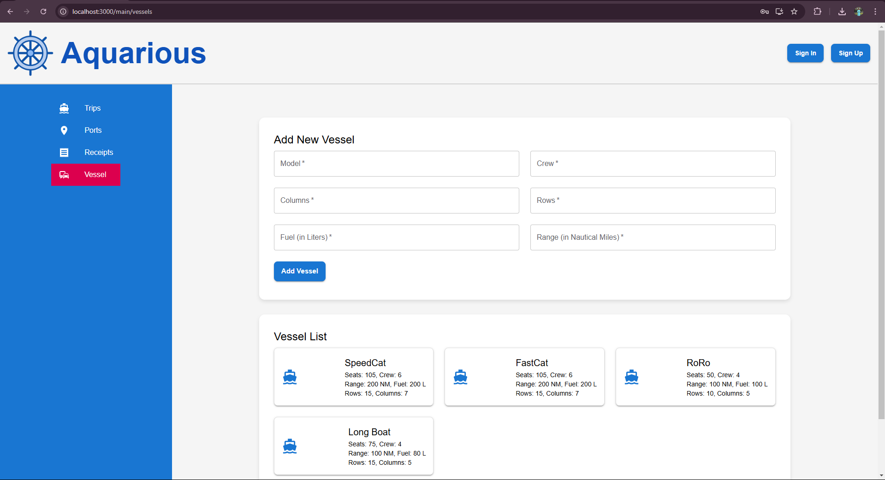
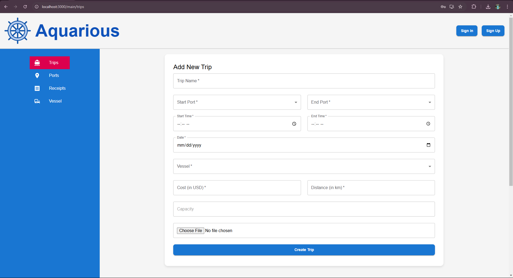
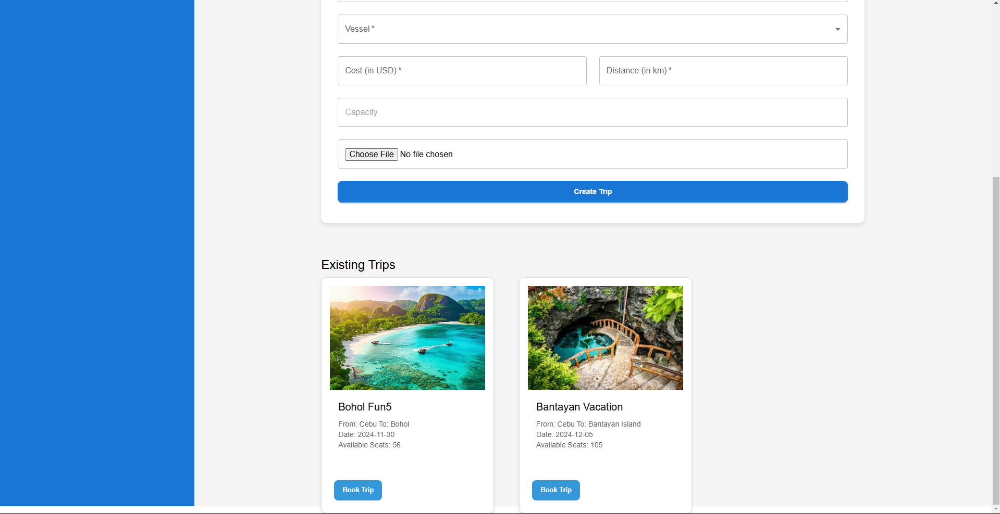
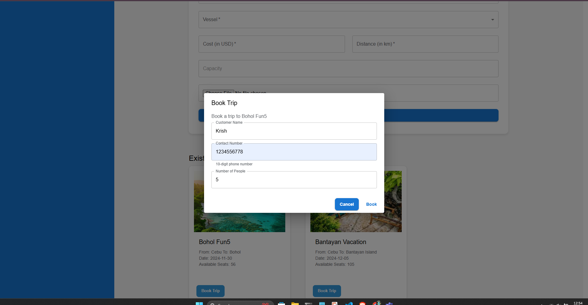
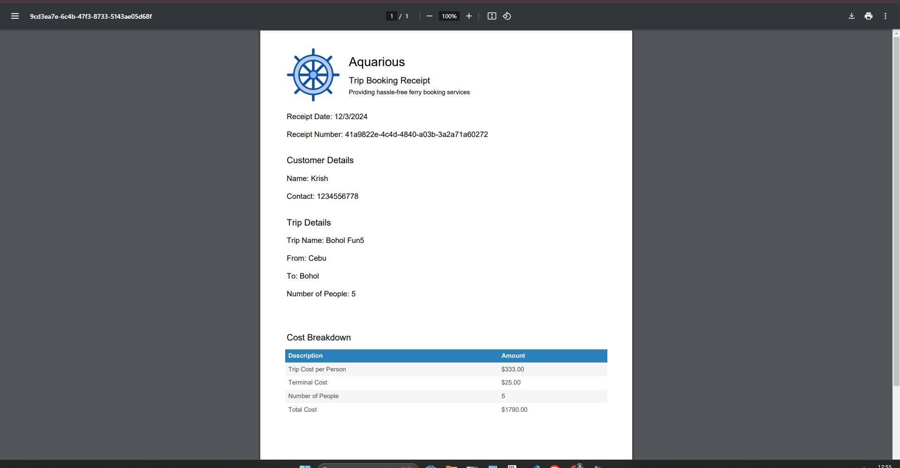

#🚢 Aquarious
A complete solution for ferry companies to manage operations, including trip scheduling, vessel management, and customer bookings.
---
## 📖 Table of Contents  
- [📝 Introduction](#-introduction)  
- [✨ Features](#✨-features)  
- [🛠️ Technologies Used](#🛠️-technologies-used)  
- [⚙️ Installation](#⚙️-installation)  
- [🚀 Usage](#🚀-usage)  
- [📂 Project Structure](#📂-project-structure)  
- [📸 Screenshots](#📸-screenshots)  


---
## 📝 Introduction  
**Aquarious** is a centralized management system for ferry companies. Designed to streamline operations, this platform empowers employees at ports to:  

- Manage and track ferry trips.  
- Book trips for customers.  
- Generate detailed receipts for transactions.  

The system supports port and vessel management while providing a visually dynamic interface with mapping (via Leaflet.js) for real-time location updates.  

---

## ✨ Features  

### 1. **Port Management**  
- Add new ports dynamically to the system.  
- Visualize ports on a real-time map.  

---

### 2. **Fleet Management**  
- Add and manage vessels with details like capacity, size, and type.  

---

### 3. **Trip Management**  
- Create and manage ferry trips between ports.  
- Assign vessels and set trip parameters such as price and timing.  

---

### 4. **Customer Booking**  
- Employees can book trips for customers.  
  - Input customer details and passenger count.  
  - Validate bookings against vessel capacity.  

---

### 5. **Receipt Generation**  
- Automatically generate PDF receipts for each booking with trip and customer details.  

---

### 6. **Map Integration**  
- View all ports and scheduled trips dynamically on an interactive map powered by **Leaflet.js**.  

---


## 🛠️ Technologies Used  

### **Frontend**  
- **React.js** with Material-UI for a responsive interface.  
- **Leaflet.js** for interactive map integration.  

### **Backend**  
- **Supabase** for backend and database management.  

### **Others**  
- **jsPDF** for PDF receipt generation.  
- **Google Translate widget** for multilingual capabilities.  

---

## ⚙️ Installation  

### **Prerequisites**  
- **Node.js**  
- **Supabase account**  
1. Clone the repository:  
   ```bash  
   git clone https://github.com/your-username/aquarious.git  
   cd aquarious  
###Install dependencies:

```bash

    npm install  

    npm start  
```
🚀 Usage
Log in as a Port Employee
Employees manage all bookings and operations.
Port and Vessel Setup
Add and manage ports and vessels for the company’s fleet.
Trip Creation
Define trips between ports, assign vessels, and set parameters like time and price.
Customer Booking
Record customer bookings at the port.
Validate capacity and generate a receipt.
Visualize Operations
Use the map to view active ports and trips.
📂 Project Structure
plaintext
Copy code
aquarious/  
│  
├── public/                 # Static assets and favicon.  
├── src/  
│   ├── components/         # Reusable React components.  
│   ├── pages/              # Page-level components.  
│   ├── assets/             # Images, logos, and other assets.  
│   ├── supabaseClient.js   # Supabase configuration.  
│   └── App.js              # Main application file.  
├── .env                    # Environment variables.  
├── package.json            # Dependencies and scripts.  
└── README.md               # Project documentation.  
📸 Screenshots
Port Management
Manage all ports with dynamic map visualization.

Fleet Management
Add and track vessels in the fleet.

Trip Booking
Seamlessly manage customer bookings.



Receipt Generation
Generate detailed PDF receipts for each booking.

